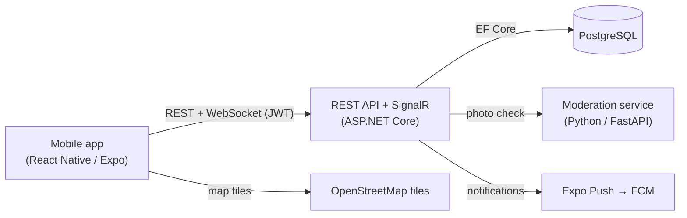

# GymLog

A full-stack mobile fitness application for tracking workouts and nutrition, with a social layer for training together. Built as a graduation project.

GymLog lets a user log workouts by exercise, set and rep, follow structured training plans (preset, AI‑generated, or rule‑based recommended), track calories and macros, monitor body weight, and visualize weekly muscle-group load. On top of that it adds friends, real‑time chat, group workout scheduling with map locations, and push notifications.

---

## Table of contents

- [Features](#features)
- [Tech stack](#tech-stack)
- [Architecture](#architecture)
- [Project structure](#project-structure)
- [Getting started](#getting-started)
- [Configuration](#configuration)
- [API overview](#api-overview)
- [Notes & future work](#notes--future-work)

---

## Features

### Training
- **Workout logging** — pick exercises, add sets (weight × reps), save to a calendar.
- **Training plans** — 9 built‑in presets, plus custom plans. A plan has weekday‑bound days; rest days are implicit.
- **Plan finder** — a short questionnaire that recommends a preset, or routes to AI when the case needs it (e.g. an injury), pre‑filling the AI prompt.
- **AI plan generation** — describe your goal in free text; a large language model builds a plan choosing only from an equipment‑filtered exercise catalog, validated server‑side.
- **Progressive overload** — starting a plan day pre‑fills weights and reps from the last time you did that same day.
- **Muscle map** — an anatomical heatmap of weekly volume; with an active plan it shows progress vs. weekly targets, otherwise raw weekly sets.
- **Personal bests** — heaviest logged set per exercise, grouped by muscle.
- **Streak** — consecutive days on plan (rest days count, missed training days break it).
- **Exercise library** — browse by muscle group and equipment, with animations and instructions.

### Nutrition
- **Food diary** — four meals, per‑100g USDA food catalog (~5,800 items), gram‑based portions with live macro preview.
- **Custom foods** — create your own private foods with per‑100g nutrition values.
- **Calorie & protein goals** — computed with the Mifflin–St Jeor equation during onboarding, and re‑calculable later when your weight changes.
- **Weekly / monthly averages** of intake.

### Body & progress
- **Body‑weight tracking** with a trend chart.
- **Progress photos** — one per day, uploaded from camera or gallery, screened by a computer‑vision moderation service (must contain a face and be non‑explicit).
- **Profile avatar** — any image, no moderation, with an initials fallback.

### Social
- **Friends** — search, request, accept; real‑time notifications.
- **Real‑time chat** — SignalR when the app is open, push notification when it isn't (hybrid delivery).
- **Group workout sessions** — invite one or more friends to a scheduled workout with an optional map location; per‑participant accept/decline; time‑conflict prevention; a host cancel removes the session for everyone while a participant can leave without affecting others.
- **Reminders** — a local notification 30 minutes before an accepted session.

### Account & security
- **JWT authentication** with short‑lived access tokens and rotating refresh tokens (silent refresh on 401).
- **Change password**, with current‑password verification.
- Passwords stored only as BCrypt hashes; every resource query is scoped to the authenticated user.

---

## Tech stack

| Layer | Technologies |
|---|---|
| **Mobile** | React Native 0.81 (Expo SDK 54), TypeScript, Expo Router, `@microsoft/signalr`, `react-native-svg`, `react-native-gifted-charts`, `react-native-body-highlighter`, `react-native-webview` (Leaflet maps), `expo-notifications`, `expo-image-picker` |
| **API** | .NET 9, ASP.NET Core Web API, Entity Framework Core, SignalR, JWT bearer auth, BCrypt.Net |
| **Database** | PostgreSQL 18 (Npgsql provider), code‑first migrations |
| **CV moderation** | Python, FastAPI, Uvicorn, OpenCV (Haar cascades for face detection), NudeNet (ONNX Runtime, explicit‑content detection) |
| **Maps** | OpenStreetMap tiles + Leaflet rendered in a WebView (no API key required) |
| **AI** | GitHub Models (OpenAI‑compatible, `gpt-4.1-mini`) for plan generation |
| **Push** | Expo Push Service → Firebase Cloud Messaging |

---

## Architecture

Three independent services. The mobile app talks only to the API; the API is the single owner of the database and orchestrates the moderation and push services.



**Key patterns**
- Layered API: controllers (read identity from JWT) → services (business logic) → EF Core.
- SignalR hub authenticates via a query‑string access token (WebSockets can't send headers).
- Hybrid message delivery: live over the hub if the recipient is connected, otherwise a push notification.
- Photo moderation is *fail‑closed* — if the CV service is down, uploads are rejected.

---

## Project structure

```
diplomski/
├── GymLog.Api/          # ASP.NET Core Web API (controllers, services, EF Core, migrations, seeders)
├── GymLog.Mobile/       # React Native (Expo) app (app/ screens, components/, services/, dto/)
└── GymLog.Moderation/   # Python FastAPI computer-vision moderation service
```

---

## Getting started

### Prerequisites
- .NET 9 SDK
- Node.js + a package manager, and the Expo tooling (`npx expo`)
- PostgreSQL 18
- Python 3.13
- Android Studio (emulator) or the Expo Go app on a physical device

### 1. Database
Create a PostgreSQL database named `gymlog` and set the connection string in `GymLog.Api/appsettings.json` (`ConnectionStrings:DefaultConnection`). Exercise and food catalogs are seeded automatically on first run.

```bash
cd GymLog.Api
dotnet ef database update
```

### 2. API
```bash
cd GymLog.Api
dotnet run
```
Listens on `http://0.0.0.0:5166`. Swagger UI is available at `/swagger` in development.

### 3. Moderation service
```bash
cd GymLog.Moderation
python -m venv venv
venv\Scripts\python.exe -m pip install -r requirements.txt
start.bat            # or: venv\Scripts\python.exe -m uvicorn main:app --port 8001
```
Runs on `http://localhost:8001`. The API calls it before saving any progress photo.

### 4. Mobile app
```bash
cd GymLog.Mobile
npm install
npx expo start
```
Scan the QR code with Expo Go, or press `a` for an Android emulator.

> Set `API_HOST` in `GymLog.Mobile/services/api.ts` to your machine's LAN IP for a physical device, or `http://10.0.2.2:5166` for the Android emulator. The device and the API must be on the same network.

---

## Configuration

| Setting | Where | Notes |
|---|---|---|
| Database connection | `GymLog.Api/appsettings.json` → `ConnectionStrings:DefaultConnection` | PostgreSQL |
| JWT | `appsettings.json` → `Jwt` | key, issuer, audience, 15‑min access token, 30‑day refresh |
| AI plan generation | `dotnet user-secrets` → `Ai:ApiKey` | a GitHub PAT with the `models:read` permission |
| Moderation service URL | `appsettings.json` → `Moderation:BaseUrl` | set `Moderation:Enabled=false` to skip CV checks in development |
| API host (mobile) | `GymLog.Mobile/services/api.ts` → `API_HOST` | LAN IP (device) or `10.0.2.2` (emulator) |

**Push notifications** require a development build (`npx expo run:android`) plus an Expo project (`eas init`) and a Firebase project — remote push does not work in Expo Go. Everything else, including real‑time chat and local reminders, works in Expo Go.

---

## API overview

All endpoints except register/login require a JWT bearer token.

| Area | Endpoints |
|---|---|
| Auth | `POST /api/auth/register`, `/login`, `/refresh`, `/logout` |
| User | `GET /api/users/me`; `POST /api/users/onboarding`, `/goals`, `/avatar`, `/change-password`, `/push-token` |
| Workouts | `POST /api/workouts/insert`; `GET /api/workouts/dates`, `/by-date`, `/streak`, `/muscle-stats`, `/personal-bests`, `/last-by-plan-day/{id}`; `GET /api/workouts/exercises`, `/exercises/{id}` |
| Plans | `GET /api/plans`, `/templates`, `/active`, `/{id}`; `POST /from-template/{id}`, `/{id}/activate`, `/generate`; plan‑exercise edits |
| Nutrition | `GET /api/nutrition/foods`, `/diary`, `/summary`; `POST /api/nutrition/foods`, `/diary`; `DELETE /api/nutrition/foods/{id}`, `/diary/{id}` |
| Body weight | `GET`, `POST /api/bodyweight` |
| Progress photos | `GET`, `POST`, `DELETE /api/progress-photos` |
| Friends | `GET /api/friends`, `/requests`, `/search`; `POST /request/{id}`, `/accept/{id}`; `DELETE /{id}` |
| Sessions | `GET /api/sessions`; `POST /api/sessions`, `/{id}/accept`, `/{id}/decline`; `DELETE /{id}` |
| Messages | `GET /api/messages/conversations`, `/{friendId}`, `/unread-count`; `POST /{friendId}`, `/{friendId}/read`; SignalR hub at `/hubs/chat` |

---

## Notes & future work

- **Progress‑photo storage** is served as static files with unguessable (GUID) names; signed URLs are a natural next step.
- **Custom foods** are private per user; a shared, moderated community catalog could follow.
- Possible extensions: reuse detection for refresh tokens, request rate‑limiting, group chat, barcode scanning for nutrition, and publishing to the app stores via EAS.

---

*Built as a graduation project. Not affiliated with any commercial fitness product.*
